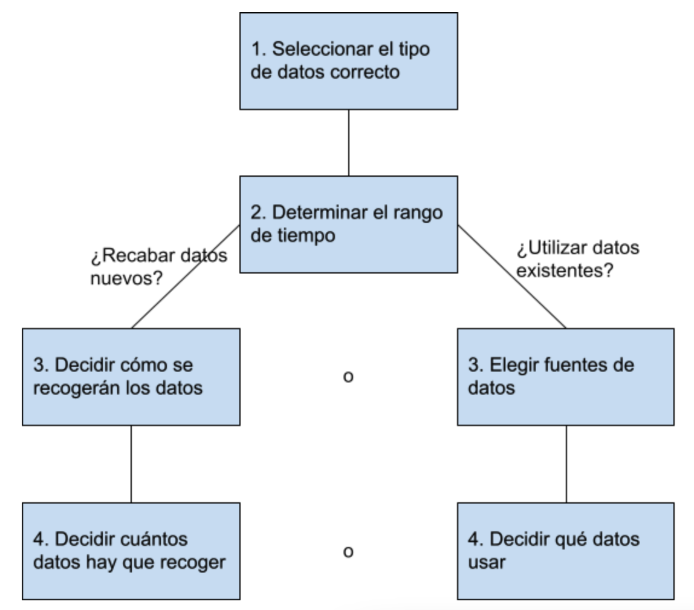

# RECOPILACIÓN DATOS

Es importante comprender de dónde provienen los datos que estamos analizando y cómo se recopilaron. Esto puede ser útil para comprender la calidad de los datos y las posibles limitaciones que puedan tener.

* **Los datos se generan constantemente:** Cada minuto se envían millones de mensajes de texto, cientos de millones de correos electrónicos y se realizan millones de búsquedas en línea.

* **Los datos se generan como resultado de nuestra actividad:** La mayor parte de los datos se generan como resultado de nuestra actividad en el mundo, especialmente en línea. Cada foto digital, cada publicación en las redes sociales y cada búsqueda que realizamos genera datos.

* **Los datos también se pueden recopilar mediante la recopilación de información:** Las empresas y las organizaciones a menudo recopilan datos mediante encuestas, formularios y otras herramientas. Estos datos se pueden utilizar para comprender las necesidades de las personas y mejorar los productos y servicios.

* **Es importante tener en cuenta la ética al generar y recopilar datos:** Debemos asegurarnos de que los datos se recopilan de forma ética y que se respetan la privacidad y los derechos de las personas.

**¿Cuáles son las formas en que se generan los datos?**

* **Nuestra actividad en el mundo:** Cada acción que realizamos en línea, como enviar mensajes de texto, correos electrónicos, realizar búsquedas en línea o ver videos, genera datos.

* **Recopilación de información:** Los datos también se pueden generar mediante la recopilación de información a través de formularios, cuestionarios y encuestas.

* **Cookies:** Las cookies, pequeños archivos almacenados en las computadoras, recopilan información sobre los usuarios y sus hábitos de navegación en línea.

* **Observaciones:** Los científicos generan datos a través de observaciones, como estudiar el comportamiento animal o analizar bacterias bajo un microscopio.

**¿Cómo se pueden recopilar datos éticamente?**

* **Consentimiento informado:** Las personas deben dar su consentimiento explícito para que se recopilen sus datos.

* **Anonimización y seudonimización:** Los datos deben ser anonimizados o seudonimizados para proteger la identidad de las personas.

* **Propósito específico:** Los datos solo deben recopilarse para un propósito específico y legítimo.

* **Seguridad de los datos:** Los datos deben almacenarse y procesarse de forma segura para evitar el acceso no autorizado.

* **Transparencia:** Las personas deben tener derecho a saber cómo se recopilan y utilizan sus datos.

Es importante que las empresas y organizaciones que recopilan datos se adhieran a estos principios éticos para garantizar la confianza y el respeto de las personas.
La recopilación ética de datos es crucial para garantizar la privacidad y el bienestar de las personas.

**Determinar qué datos recolectar**

* **Tipo de datos:** Primero, debemos decidir qué tipo de datos necesitamos recopilar. Esto dependerá del problema que estemos tratando de resolver. Por ejemplo, si estamos tratando de averiguar qué está causando el aumento del tráfico en hora pico en una ciudad, podríamos recopilar datos sobre los patrones de tráfico observando el número de coches en las calles de la ciudad durante horas determinadas.

* **Fuentes de datos:** También debemos decidir de dónde vamos a obtener los datos. Hay tres tipos principales de fuentes de datos:

    * **Datos de primera mano:** Estos son datos que nosotros mismos recopilamos.

    * **Datos de segunda mano:** Estos son datos que otra persona o grupo ha recopilado y luego vendido.

    * **Datos de tercera mano:** Estos son datos que han sido recopilados por otra persona o grupo y luego puestos a disposición del público.

* **Tamaño de la muestra:** También debemos decidir cuántos datos necesitamos recopilar. Esto dependerá del tamaño de la población que estamos estudiando y del nivel de precisión que necesitamos.

* **Marco de tiempo:** Por último, debemos decidir durante cuánto tiempo necesitamos recopilar datos. Esto dependerá del problema que estemos tratando de resolver. Por ejemplo, si estamos tratando de averiguar qué está causando el aumento del tráfico en hora pico en una ciudad, podríamos recopilar datos durante una semana o un mes.

**Consideraciones sobre la recopilación de datos:**

* Cómo se recopilarán los datos
* Fuentes de datos
* Resolver el problema empresarial
* Cuántos datos hay que recopilar
* Marco temporal

